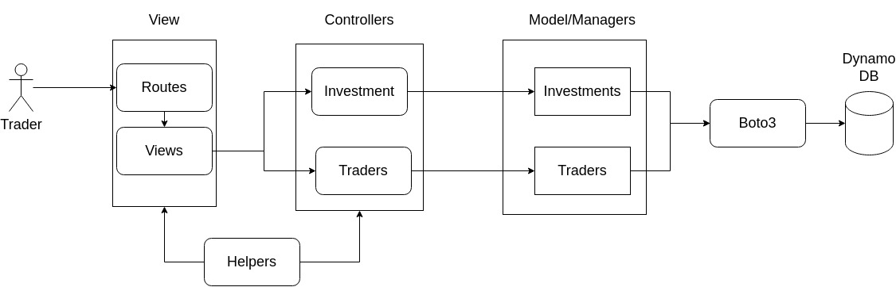

<h1>Nemonic languaje</h1>

<h3>Trader</h3>
Makes reference to abstraction of user , because is the high level abstraction name for the users of the API

<h3>Investment</h3>
Makes reference to the abstraction about the
domain products/object this API , it should have a type on this
case the allowed types are Symbols (for country moneys Ie COP) and Stocks(for business actions Ie Amazon)
<h3>Price</h3> Abstraction for the way that is stored the information in the database , but also means the prices for a investment in a timestamp

<h1> Data design </h1>
<h3>Trader</h3>

```javascript
{
    "Id":"644sw",
    "Password":"8d9d883a0eb4723e2f614b2c4240f7"
    "Stocks":["Amazon","Google"],
    "Symbols":["COP","USD"],
    "UserName":"user1"
}
```

The password is stored with a HASH-MD5

<h3>Investment</h3>

```javascript
{
    "Id":"4154",
    "Name":"COP"
    "Price":"7500",
    "TimeStamp":"2022-07-25 19:00:06",
    "Type":"Symbol"
}

{
    "Id":"4154",
    "Name":"Google"
    "Price":"7500",
    "TimeStamp":"2022-07-25 19:00:06",
    "Type":"Stock"
}
```

<h1>API endpoints</h1>

The API URL has the following nemonic convension (in the most cases)
\<which domain object use\>\<which type of investment use\>\<which action to do\>

if use a general logic just use the / and the action to do

- General logic:
  - /login
  - /logout
- Investments Logic
  - /investments/symbols
  - /investments/stocks/price/<investment_name>/<start_date>/<end_date>
  - /investments/stocks/export
- Traders Logic
  - /traders/symbols
  - /traders/symbols/update

<h1>Dates formats</h1>

- For user is used the format dd-mm-yyyy
- Internallty the date is stored as timpestamp with format yyyy-mm-dd H:M:S

The reason for that two formas is because for the user is more readable on this way , and it can put it on the URI for the querys, and in the DB is because that way dynamo DB search in a better way

<h1>Architecture</h1>

For this API is used a architecture of Model Controller View(MVC) as follows



For code documentation check [this link](https://htmlpreview.github.io/?https://github.com/jgamer42/leanware_test/blob/master/doc/pydoc/index.html)
